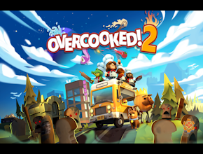
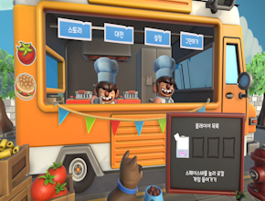
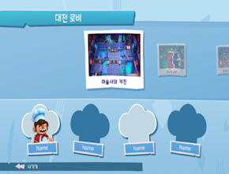
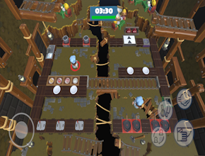

<h1>Overcooked! 2 모작 프로젝트</h1>
Overcooked! 2는 원작을 모작한 3D 협동 시뮬레이션 게임입니다. 
이 프로젝트는 Unity를 활용하여 팀 프로젝트로 개발되었으며, Overcooked 시리즈의 협동 플레이와 재미를 재현하는 데 중점을 두었습니다.

## 스크린샷

|  |  |
|:---:|:---:|
| 타이틀 화면 | 메인 화면 |

|  |  |
|:---:|:---:|
| 대전 룸 화면 | 모바일 플레이 화면 |

## 목차
  - [개요](#개요) 
  - [개발 환경](#개발-환경)
  - [링크](#링크)
  - [프로젝트 특징](#프로젝트-특징)
  - [구현한 컨텐츠](#구현한-컨텐츠)

## 개요
- **개발 기간:** 2024.05.09 ~ 2024.04.27(약 3주)
- **프로젝트 유형:** 팀 프로젝트 (팀장: 윤성욱, 팀원: 김민석, 석은주, 송인석)

## 개발 환경
- **개발 엔진 및 언어:** Unity 2021.3.36f1 LTS, C#
- **IDE:** Visual Studio 2022, Jetbrains Rider

## 링크
- **포트폴리오:** https://drive.google.com/file/d/1vwhqIVacjQTbJdKHxcvxjnnFavYHgamr/view?usp=sharing
- **시연 영상:** https://youtu.be/ONO0m8uEJSU

## 프로젝트 특징
- **다양한 상호작용 구현:** 플레이어는 8방향으로 움직이며, 재료를 줍고, 던지고, 썰기 등의 상호작용을 통해 요리를 준비할 수 있습니다.
- **레시피 및 조리 시스템:** 다양한 조리 도구를 활용해 여러 가지 레시피를 구현하고, 조리 과정이 시각적으로 표시됩니다.
- **실시간 멀티플레이어 지원:** Mirror 네트워크 라이브러리를 사용해 최대 2명의 플레이어가 참여하는 온라인 멀티플레이어를 지원하며, 실시간으로 상호작용을 동기화합니다.
- **모바일 플랫폼 최적화:** 다양한 해상도와 사양의 모바일 기기에서 원활한 성능을 유지할 수 있도록 메쉬 병합 및 드로우콜 최적화를 적용했습니다.
- **이벤트 기반 게임플레이:** EventManager를 통해 게임 내 다양한 이벤트가 발생하며, UI 및 게임 상태가 동기화됩니다.

## 구현한 컨텐츠

### 플레이어 이동 및 상호작용
- 캐릭터의 8방향 이동과 대시 기능 구현
- 재료 줍기, 놓기, 던지기 등의 상호작용 기능 구현
- 싱글 모드에서 조작 캐릭터를 전환할 수 있는 기능 제공

### 레시피 및 조리 시스템
- 다양한 조리 도구(도마, 프라이팬, 냄비 등)를 활용한 레시피 구현
- 조리 진행 상태를 시각적으로 보여주는 슬라이더 UI와 아이콘 표시

### 멀티플레이
- 최대 2명의 플레이어가 참여할 수 있는 온라인 멀티플레이어 기능 구현
- Mirror 네트워크 라이브러리를 사용하여 플레이어의 움직임과 상호작용을 실시간으로 동기화

### 모바일 플랫폼 지원
- 가상 조이스틱과 버튼을 활용한 터치 인터페이스 제공
- 다양한 해상도와 사양의 모바일 기기에서 성능 최적화를 위해 메쉬 병합 및 드로우 콜 최적화 구현

### 이벤트 시스템
- EventManager를 통해 게임 내 다양한 이벤트를 처리하고, UI 및 게임 상태를 동기화